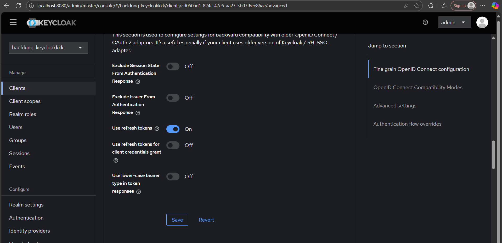

# Spring Boot + Keycloak OAuth2 Demo

This project demonstrates integration of **Spring Boot** with **Keycloak** using **OAuth2 / OpenID Connect**, including:
- User authentication via Keycloak
- Realm roles (e.g., `NICE`)
- Automatic **Refresh Token** support
---

## **Truy cập vào app http://localhost:8081/**

- Điều hướng tới Keycloak để sign in

- Điền thông tin yêu cầu về mail, họ tên

- Đăng nhập thành công, xác thực ROLE: NICE nên chuyển hướng tới nice.html

---

## **REFRESH TOKEN**
- Kéo dài session của user mà không cần login lại
- Đăng nhập vào admin console, kích hoạt 

--> Mở tab mới vẫn còn ở trạng thái login

